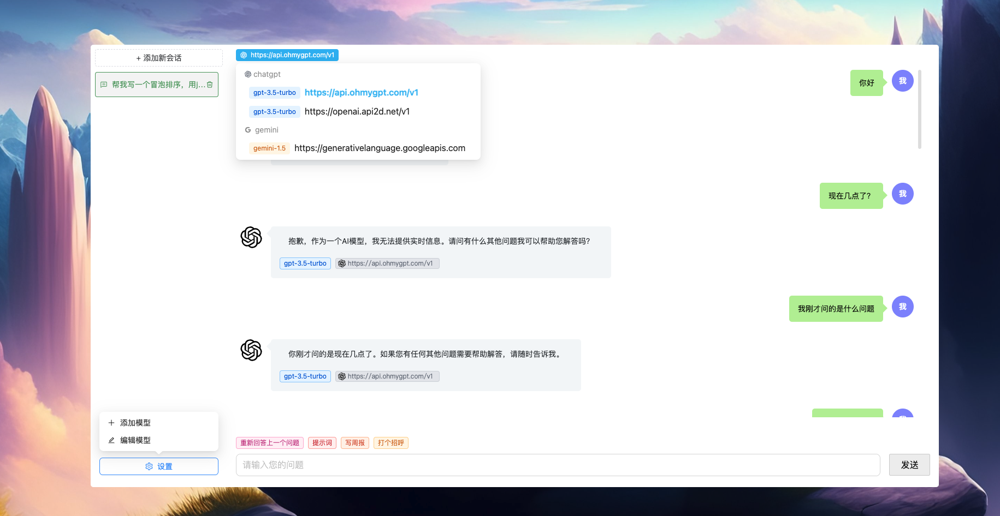
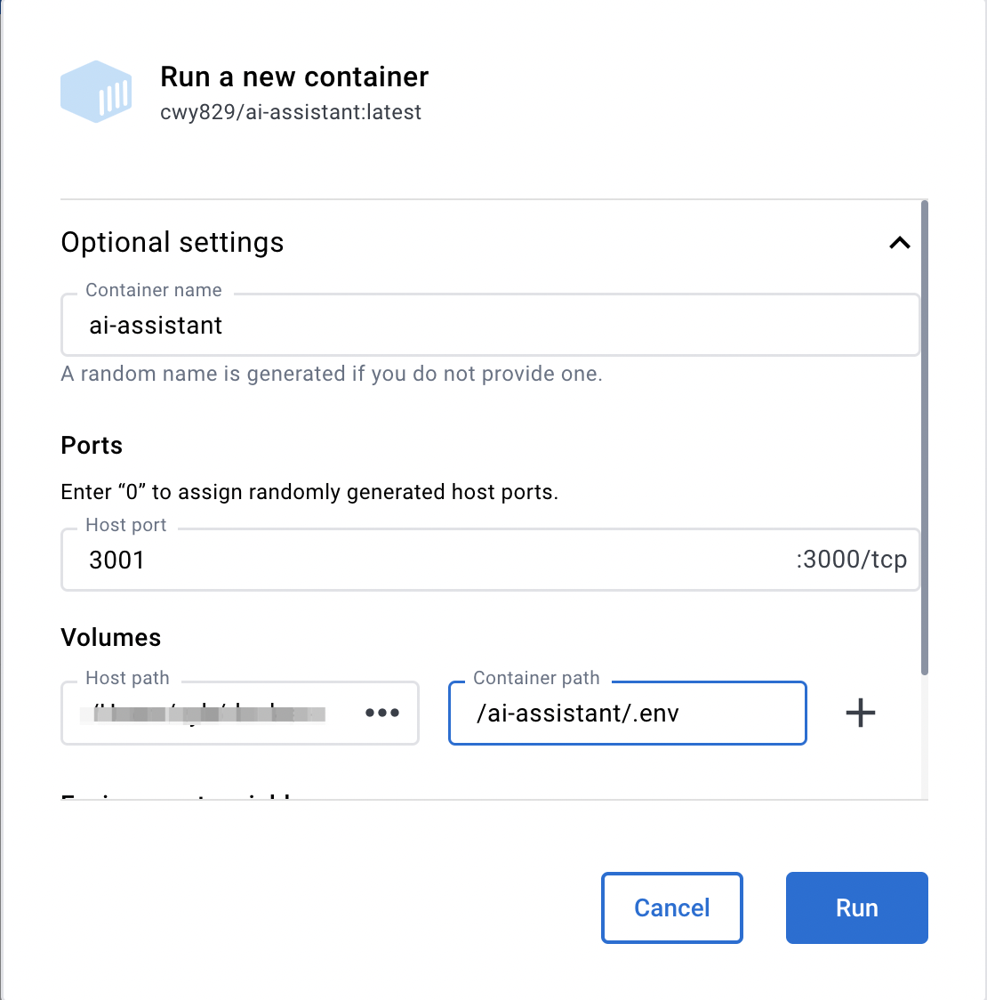

[中文文档](./README_zh.md)

# An AI Assistant

This is an AI project that integrates various open source AI capabilities.

## Project Introduction



Let everyone have the ability to use AI.

## Node Version

Node version >= 18 is required.

## Environment Variables

In root directory, copy an `.env.example` file and rename it to `.env`, then modify its fields:

```
# Server Port, eg: 3000
SERVER_PORT=3000

# CUSTOM_PROXY represents an http proxy. If left blank or not passed any value,
# it means that the http proxy is not enabled.
# eg: http://127.0.0.1:7890
CUSTOM_PROXY=
```

- `CUSTOM_PROXY`: represents an http proxy. If left blank or not passed any value, it means that the http proxy is not enabled.

## How to Develop?

1. Add a new [.env](#environment-variables) file locally and configure the corresponding parameters.
1. First install dependencies, install code using `pnpm i` in the root directory.
1. Start the project: execute `npm run dev` in the root directory.
1. Access the project address: `http://localhost:3000`.

## How to Use?

### Method 1: One-click Startup

Execute `npm start` in the root directory.

### Method 2: Separate Front-end and Back-end Startup

1. Start front-end:`pnpm run dev:fe`.
2. Start back-end:`pnpm run dev:be`.
3. Access front-end project address, eg:`http://localhost:8000`.

### Method 3: Get from Docker

[Get from here](https://hub.docker.com/r/cwy829/ai-assistant)

#### Get Image

```
docker image pull cwy829/ai-assistant
```

#### Start Container

> In the command below, `~/docker-data/.env` needs to be replaced with the address where your `.env` file is located.
> For more information on `.env`, please refer to [here](#environment-variables).

```
docker run -d -p 3000:3000 -v ~/docker-data/.env:/ai-assistant/.env --name ai-assistant cwy829/ai-assistant
```

#### Docker client startup configuration



For more information about Docker, please refer to the [documentation](./DOCKERHELP.md).
