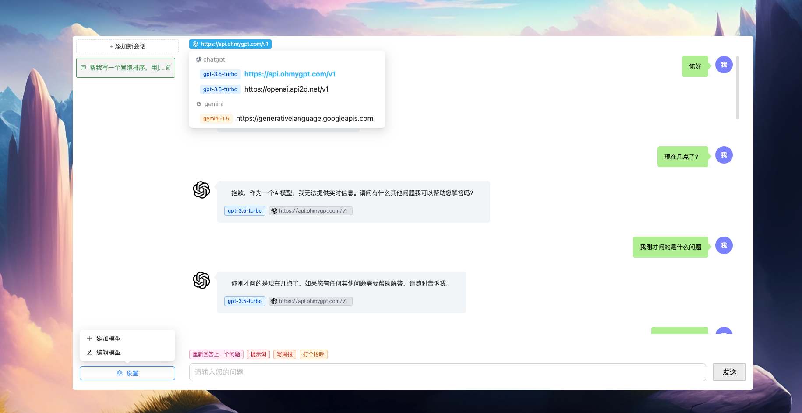

[English Document](./README.md)

# 一个 AI 助手

这是一个 AI 项目，集成各种开放 AI 的能力。

## 项目介绍



让每个人都拥有可以使用 AI 的能力。

## node 版本

需要 node >= 18 版本

## 环境变量

在根目录下，复制一个.env.example 文件重命名为.env，修改其中的字段：

```
# Server Port, eg: 3000
SERVER_PORT=3000

# TIMEOUT Time,eg: 2 * 60 * 1000
REQUEST_TIMEOUT=

# CUSTOM_PROXY represents an http proxy. If left blank or not passed any value,
# it means that the http proxy is not enabled.
CUSTOM_PROXY=

```

- `CUSTOM_PROXY`: 表示 http 代理，如果不配置，则表示没有使用 http 代理

## 如何开发？

1. 本地新增 [.env](#环境变量) 文件，配置相应参数。
1. 首先安装依赖，`根目录`下安装依赖，使用 `pnpm i` 安装代码。
1. 启动项目：根目录下执行`npm run dev`。
1. 访问项目地址：`http://localhost:3000`

## 如何使用？

### 方式一：一键启动

在根目录下执行 `npm start`

### 方式二：分前后端启动

1. 启动前端：`npm run dev:fe`
2. 启动后端：`npm run dev:be`
3. 访问前端项目地址：`http://localhost:8000`

### 方式三：从 docker 获取

[从这里获取](https://hub.docker.com/r/cwy829/ai-assistant)

#### 获取 Image

```
docker image pull cwy829/ai-assistant
```

#### 启动 Container

> 下面命令里面 `~/docker-data/.env` 需要替换成你的 `.env` 文件存放的地址
> 更多关于 .env 的信息参考[这里](#环境变量)

```
docker run -d -p 3001:3000 -v ~/docker-data/.env:/ai-assistant/.env --name ai-assistant cwy829/ai-assistant
```

#### docker 客户端启动配置


更多关于 docker 的知识，请查看 [文档](./DOCKERHELP_zh.md)
